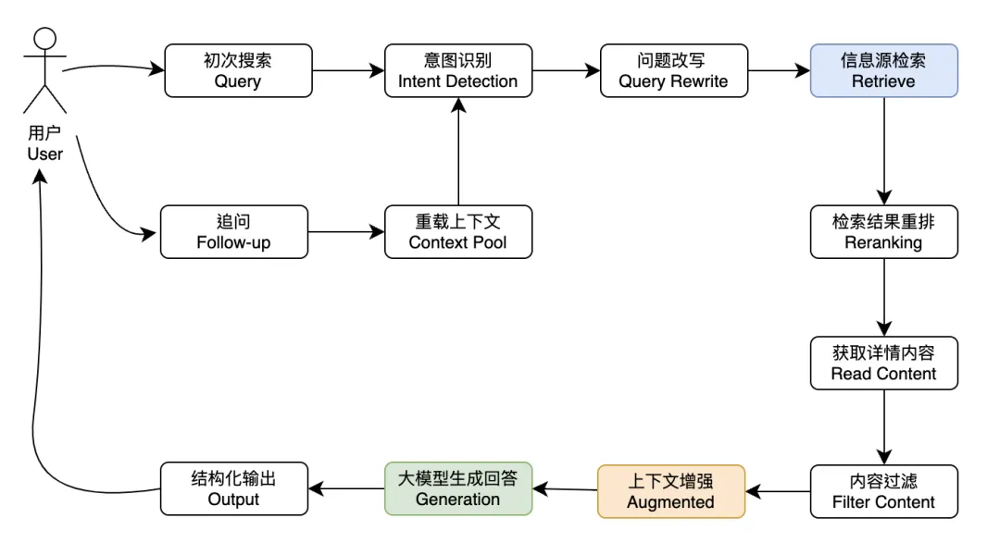
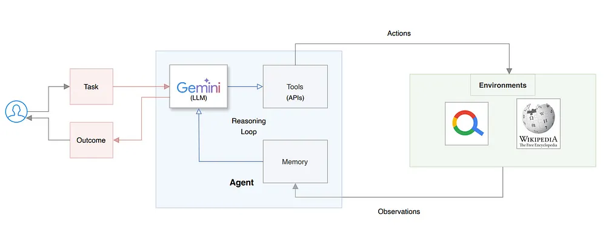

# aiagent
my research for ai agent 
This repository provides an overview of AI agents, their implementation, and relevant open-source projects.

## Table of Contents
- [aiagent](#aiagent)
  - [Table of Contents](#table-of-contents)
  - [Introduction](#introduction)
  - [What are AI Agents?](#what-are-ai-agents)
  - [Retrieval-Augmented Generation (RAG)](#retrieval-augmented-generation-rag)
  - [Implementation Flow](#implementation-flow)
  - [构建基于大型语言模型（LLM，如 GPT）的应用程序的框架如langchain Advantages and Disadvantages](#advantages-and-disadvantages)
  - [Open Source Projects](#open-source-projects)
  - [AutoAgent](#autoagent)
  - [国内大模型](#国内大模型)
  - [berkeley](#berkeley)
  - [References](#references)
  - [paper](#paper)
  - [Contribution](#contribution)

## Introduction
AI agents are systems capable of autonomously performing tasks on behalf of users by designing workflows and utilizing available tools.

## What are AI Agents?
An AI agent refers to a system or program that autonomously performs tasks on behalf of a user or another system.

## Retrieval-Augmented Generation (RAG)
RAG combines traditional information retrieval systems with generative large language models (LLMs) to enhance the accuracy and relevance of generated content.

## Implementation Flow

*Flowchart of RAG  Implementation*

*Flowchart of AI Agent Implementation*

## 构建基于大型语言模型（LLM，如 GPT）的应用程序的框架如langchain Advantages and Disadvantages
- **Advantages**: Enhanced task performance, real-time information retrieval, and adaptability.
- **Disadvantages**: Complexity in implementation and potential over-reliance on AI.

## Open Source Projects
- [Float32](https://github.com/KevinZonda/float32.git)
- [Lepton Search](https://github.com/leptonai/search_with_lepton.git)
- [React from Scratch](https://github.com/arunpshankar/react-from-scratch.git)

  在这儿提到datawhale的一个开源项目，主要内容包括：
- [mini llm  、mini rag 、mini agent](https://github.com/datawhalechina.git)
  
        深入剖析大模型原理——Qwen Blog
        逐步预训练一个手搓大模型——Tiny Llama3
        如何评估你的大模型——Tiny Eval
        纯手工搭建 RAG 框架——Tiny RAG
        手搓一个最小的 Agent 系统——Tiny Agent
        深入理解大模型基础——Tiny Transformer

- [Cify](https://dify.ai/)
- [Coze](https://coze.com/)
- [FastGPT](https://tryfastgpt.ai/)
- [MCP](https://modelcontextprotocol.io/introduction)
  
## AutoAgent
- [AutoGPT](https://github.com/Significant-Gravitas/AutoGPT.git)
- [BabyAGI](https://github.com/yoheinakajima/babyagi)
- [Microsoft JARVIS](https://github.com/microsoft/JARVIS.git)
- [HyperWrite Assistant](https://www.hyperwriteai.com/)
  
## 国内大模型
零一万物、百川智能、智谱 AI、月之暗面、Minimax、阶跃星辰、DeepSeek
[极客时间:] (https://time.geekbang.org/column/article/820266)

## berkeley CS294/194-196
Course Description
In this class, we will introduce foundations of Large Language Models (LLMs), discuss the infrastructure, tooling, and best practices for building and running applications with LLMs, and explore the risks and challenges with these technologies and how we can build towards a responsible and democratized and decentralized future with AI. 
[CS294/194-196](https://rdi.berkeley.edu/responsible-genai/f23)

## References
- [Arxiv Sanity](https://arxiv-sanity-lite.com/)
- [Papers with Code](https://paperswithcode.com/sota)
- [idoubi](https://mp.weixin.qq.com/s/25eXZi1QgGYIPpXeDzkQrg)
- [building-react-agents-from-scratch-a-hands-on-guide](https://medium.com/google-cloud/building-react-agents-from-scratch-a-hands-on-guide-using-gemini-ffe4621d90ae)
- [the-complete-beginners-guide-to-autonomous-agents](https://www.mattprd.com/p/the-complete-beginners-guide-to-autonomous-agents)

## paper
- [HuggingGPT: Solving AI Tasks with ChatGPT and its Friends in Hugging Face](https://arxiv.org/pdf/2303.17580)
- [TradeExpert-一种基于专家混合模型（Mixture of Experts, MoE）的框架](https://arxiv.org/html/2411.00782v1)
- [TradingAgents: Multi-Agents LLM Financial Trading Framework-一种全新的股票交易框架](https://arxiv.org/html/2412.20138v3)
- [Google发布的继Transformer架构之后的继任者 TITANS](https://arxiv.org/pdf/2501.00663v1)

## Contribution 

- First, fork and think about which category the work should belong to.
- Second, use the same format as the others to discribe the work.
- pull the requirst.

**Don't worry if you put all these wrong, we will fix them for you.** Just contribute and promote your awesome work here!

